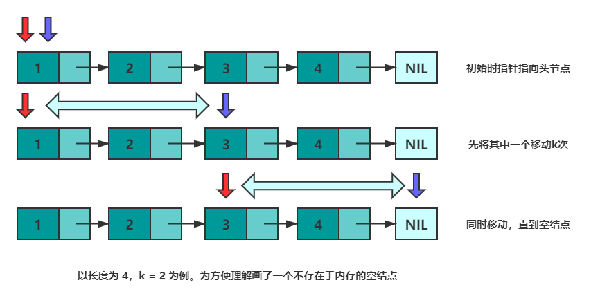
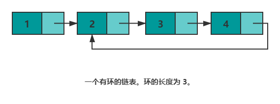

# 问题总结
无法高效获取长度，无法根据偏移快速访问元素，是链表的两个劣势。然而面试的时候经常碰见诸如获取**倒数第k个元素，获取中间位置的元素，判断链表是否存在环，判断环的长度等和长度与位置有关**的问题。这些问题都可以通过灵活运用双指针来解决。

## Tips：双指针并不是固定的公式，而是一种思维方式~

先来看"倒数第k个元素的问题"。设有两个指针 p 和 q，初始时均指向头结点。首先，先让 p 沿着 next 移动 k 次。此时，p 指向第 k+1个结点，q 指向头节点，两个指针的距离为 k 。然后，同时移动 p 和 q，直到 p 指向空，此时 q 即指向倒数第 k 个结点。可以参考下图来理解：



```
class Solution {
public:
    ListNode* getKthFromEnd(ListNode* head, int k) {
        ListNode *p = head, *q = head; //初始化
        while(k--) {   //将 p指针移动 k 次
            p = p->next;
        }
        while(p != nullptr) {//同时移动，直到 p == nullptr
            p = p->next;
            q = q->next;
        }
        return q;
    }
};
```
获取中间元素的问题。设有两个指针 fast 和 slow，初始时指向头节点。每次移动时，fast向后走两次，slow向后走一次，直到 fast 无法向后走两次。这使得在每轮移动之后。fast 和 slow 的距离就会增加一。设链表有 n 个元素，那么最多移动 n/2 轮。当 n 为奇数时，slow 恰好指向中间结点，当 n 为 偶数时，slow 恰好指向中间两个结点的靠前一个(可以考虑下如何使其指向后一个结点呢？)。


下述代码实现了 n 为偶数时慢指针指向靠后结点。

```
class Solution {
public:
    ListNode* middleNode(ListNode* head) {
        ListNode *p = head, *q = head;
        while(q != nullptr && q->next != nullptr) {
            p = p->next;
            q = q->next->next;
        }
        return p;
    } 
};
```
是否存在环的问题。如果将尾结点的 next 指针指向其他任意一个结点，那么链表就存在了一个环。


上一部分中，总结快慢指针的特性 —— 每轮移动之后两者的距离会加一。下面会继续用该特性解决环的问题。
当一个链表有环时，快慢指针都会陷入环中进行无限次移动，然后变成了追及问题。想象一下在操场跑步的场景，只要一直跑下去，快的总会追上慢的。当两个指针都进入环后，每轮移动使得慢指针到快指针的距离增加一，同时快指针到慢指针的距离也减少一，只要一直移动下去，快指针总会追上慢指针。


根据上述表述得出，如果一个链表存在环，那么快慢指针必然会相遇。实现代码如下：

```
class Solution {
public:
    bool hasCycle(ListNode *head) {
        ListNode *slow = head;
        ListNode *fast = head;
        while(fast != nullptr) {
            fast = fast->next;
            if(fast != nullptr) {
                fast = fast->next;
            }
            if(fast == slow) {
                return true;
            }
            slow = slow->next;
        }
        return nullptr;
    }
};
```
最后一个问题，如果存在环，如何判断环的长度呢？方法是，快慢指针相遇后继续移动，直到第二次相遇。两次相遇间的移动次数即为环的长度。
